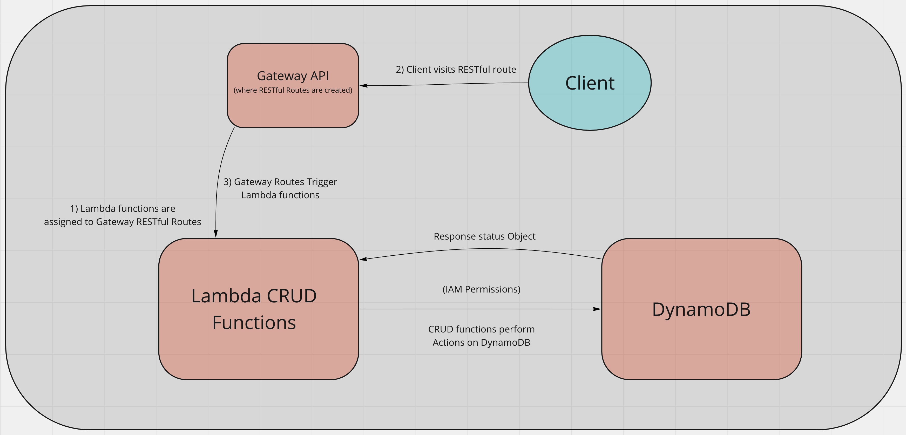

# serverless-api

Author: Jessi Velazquez

# UML

(All Amazon Web Services (AWS) platforms are in red)



**Root URL:** people/

**Routes:**
  
  - **POST**

    - This route is to people/. It takes in an object ```"{\"body\":{\"id\":\"123456789\",\"name\":\"test_user\",\"phone\":\"123-456-7890\"}}"``` as an input, and returns a status code of 200 and a stringified JSON object. This will create people and put them into the DynamoDB databse.

  - **GET**

    - This route is either to people/ (for all DB records), or to people/id (for a single ID record). If passing a request body, one must pass the ID from DynamoDB to the function as part of a JSON object. Otherwise, you will get all database records. 

  - **PUT**

    - This will update a record in the database. It takes a request object that ID field must match a record in DynamoDB. It will give you the updated user in the returned object.

    ```
    {   
      "body": {
        "name": "updated-test-user",
        "phone": "updated-number"
      },
      "queryStringParameters": {
          "id": "305a99d7-47f9-42df-9ccb-d0b33fc54014"
      }
    }
    ```

  - **DELETE**

    - This is a delete function, that takes an object identical to the one above, but all fields must match a record in the DynamoDB.